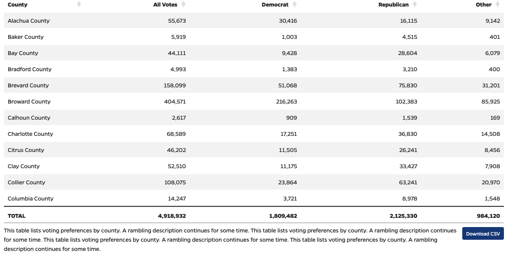

# WPShortcode-csvtable

A Wordpress shortcode to list a CSV as a DataTables table.

Amenities and features:
- Supply an arbitrary CSV file, enter a WP shortcode, and get a sortable table
- uses jQuery DataTables https://datatables.net/ though with much interactivity turned off
  - sortable tables
  - infinite extensibility if you want yours to do something else
- Download CSV button linking to the source CSV
- Caption, which is ARIA-linked to the table for a11y


## Quick Start

1. Upload the files to your theme.

2. Include the `csvtables/functions-csvtables.php` file in your theme's `functions.php` file.

```
require_once 'csvtables/functions-csvtables.php';
```

3. Use a shortcode like this, supplying a CSV file, a list of column names, and a list of names for those columns.

```
[csvtable csvfile="/data/2022_General_Turnout_Rates.csv" columns="STName,Vot_Cnt,VAPcount" labels="State,Votes Counted,Voting Age Population" totals="Vot_Cnt,VAPcount"]
```




## Shortcode Options

* `csvfile` = Required. URL of the CSV file.
* `columns` = Comma-joined list of which CSV columns to display, and in what sequence.
* `columnlabels` = Comma-joined list of column headings corresponding to those `columns`
  * If omitted, the `columns` will be used.
* `totals` = Comma-joined list of column names for which totals should be shown at the bottom.
  * These fields should be a subset of the fields in `columns`
  * If omitted, then the Total row will not be displayed.
* `tablecssclasses` = CSS classes to apply to the table, to fit into your site's other table styles.
  * Default is `table table-sm table-hover table-striped table-bordered` which fits Bootstrap 4 and 5.
* `downloadbuttoncssclass` = CSS classes to apply to the Download PNG button, to fit into your site's other buttons and style.
  * Default is `btn btn-sm btn-primary` which fits Bootstrap 4 and 5.
  * If you specify blank `downloadbuttoncssclass=""` then the button will not be displayed.
* `caption` = An optional caption to be placed below the table. This is linked to the table's `aria-describedby` for accessibility purposes.
* `width` = A width for the generated map, in CSS format.
  * Example: `width="800px"`
